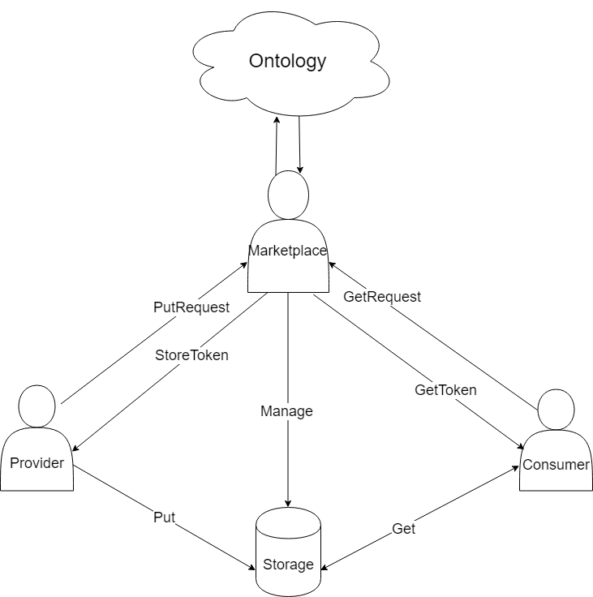
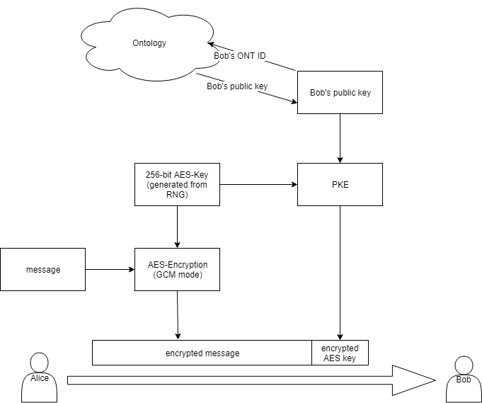

<h1 align="center">去中心化数据交换协议</h1>
<p align="center" class="version">Version 0.8.0 </p>

## 摘要

针对目前中心化数据交易所的痛点如：数据缓存、隐私数据未经用户授权、数据版权无法保护等问题，本体提出分布式数据管理协议ONT DATA，并基于此协议推出去中心化数据交易框架DDXF。本体生体应用开发者可以基于DDXF开发满足各种细分场景需求和各具特色的去中心化数据交易应用，并支持数据交易平台之间交易互通。

## ONT DATA概述

为解决中心化数据交易和协作存在的痛点，ONT DATA协议使用去中心化设计模式，具体包括一系列子协议。 

## 名称定义

| 术语           | 描述                                       | 
| ------------ | ---------------------------------------- |
| 数据需求方         | 需要数据的机构/企业/个人                                  | 
| 数据提供方          | 提供数据的机构/企业/个人，数据可以是源数据，也可以是加工数据，数据提供需要完全满足当地政府的法律法规；                                   | 
| 资产化合约        | DatAsset Smart Contract，简写为 DSC。<br/>数据资产化，进一步上链，由智能合约支持。在合约中描述数据结构和资产化数据的合约，称为资产化合约。<br/>DSC 包含（但不限于）：DToken，发行人，评审人。 | 
| 资产化数据        | 由用户产生，具有价值的数据。任何数据都有可能成为资产化数据。包括数据、声明、证明等。<br/>资产化数据由资产元数据描述，通过资产化合约管理。<br/>也称“数据资产”。 | 
| 资产元数据        | Metadata，数据资产模板。<br/>对于资产化数据的数据结构和约束的描述。<br/>在资产化合约履行过程中根据资产元数据检验资产化数据。 | 
| 资产元数据规约      | 资产元数据（数据资产模板）的描述性语言。<br/>提供资产模板的格式、约束和语言范式。 | 
| 评审人          | 站在数据资产买方而言，对于数据的质量有一定的要求，仅靠买方代理无法保证数据质量。通过在合约预设评审人机制，在一定“可信”范围内保证数据质量。<br/>评审人可以是链内、链外；用户、角色用户集、评审小程序、AI等。 |       
| 交易合约         | eXchange Smart Contract，简写为 XSC。<br />DSC 发布的合约 Token（DToken），资产价值的计算直接通过 DToken 锚定。XSC 描述 DToken 到支付链上 Token（如，ONT）的兑换模式等。<br/>技术上参考交易所的相关解决方案。因此以“交易合约”命名此类合约。<br />简单交易合约考虑，<br />双 Token 兑换（DToken：ONT）；<br />二次提交（请求数据时买方预锁资产：数据交割后结算）；<br />双签（买方预签：卖方DToken签名凭证）。       |
| 去中心化数据交易所 |     DDXF的使用者，作为一个服务机构，主要工作包括：1、运营可视化的数据交易页面或社区 2、制定行业中的数据交易和交换标准，便于买卖双方以及交易参与方高效交易。各行各业数据交换标准会有很大差异性，所以将有各种不同类型的去中心化数据交易所。    | 


## DataToken

DataToken（简称 DToken）是一个专门用于数据交换的智能合约，实现链外交换数据在链上的映射，从而能实现链上价值交割和链外数据交换的一致性。

DataToken中包括元数据MetaData，MetaData是对于资产化数据的数据结构和约束的描述。

在实例化DataToken过程中，将结合密码学组件，如数据水印等等，用于数据交易的追溯和版权追踪。

### 1.DToken设计初衷

DToken的目的是将任何的数据、实体Token化，DToken可以在DDXF交易，目前以NEP-5,ERC20为代表的Token都是“同质化Token”, 他无法将token和实体映射，DToken的定位是典型的“非同质化”token,即每一个token都是不同的，都有唯一的tokenId

目前的以太坊的[ERC721](https://github.com/ethereum/EIPs/blob/master/EIPS/eip-721.md),已经提出了这一标准,non-fungible tokens，简称NFT

### 2.为什么需要DataToken

在NEP-5代币中，每个代币的都是同样的，无法将一个Token和资产映射，谁控制了私钥，谁就拥有了这个Token,但是在现实中，房子、数据都是不同的，他们都有真正的Owner，具有不同的属性

### 3.DataToken可以支持评审人机制

在去中心化的场景中，对数据质量的评定，我们交给评审人设置，评审人可以为数据进行打分，从而影响数据交换的价值，甚至取消交易。具体规则在交易合约中实现。

### 4.DataToken合约 API设计

 * **mintToken**(owner, auditor, url): 发行DToken。
 * **name**(): Token名称
 * **symbol**(): Token符号
 * **balanceOf**(owner): 返回Owner当前所有的Dtoken
 * **totalSupply**(): 返回已发行Dtoken总量，数量会随着一直增加
 * **modifyURI**(tokenid, URI): 修改TokenURI
 * **tokenURI**(tokenid): 返回token映射实体物的位置
 * **ownerOf**(tokenid): 返回指定token的所有者
 * **transfer**(from, to, tokenid):交换Dtoken
 * **evaluate** (tokenid, ontid)：指定的ontid给tokenid打分
 * **getRating**(tokenid) （获取指定tokenid的打分)
 * **changeAuditor**(tokenid,ontid) （修改tokenid的打分人)

## 工作模式


## 基于智能合约“一手交钱，一手交货”

为了保证交易双方的权益，在协议的交易流程中引入一个作为“担保人”的中间方，保证“一手交钱，一手交货”的结算过程。该中间方负责保管买方的资金，并根据最终交易结果将该资金转给卖方或退回给买方。因为中间方负责交易的最终结算，必须具备足够的公正性与安全性。依托于分布式账本运作的智能合约，具有公开且去中心化管理的特点，十分适合承担中间方的角色。

此合约用于资金的锁定与分配。
合约接受用户账户输入的资金，锁定一定时间。在锁定期间内任何人无法动用这笔资金。锁定结束后按照指定的分配规则将资金分发给其他账户。


### 角色

合约涉及的三个角色：

* 付款人：创建实例，输入资金
* 收款人：由付款人指定，在锁定结束后取得资金
* 评审人：可选角色，由付款人指定，并需收款人确认，有权决定最终分配的资金额。


### 流程

资金锁定及分配的流程如下：

```
生成分配实例  锁定资金        锁定期限
   |----------|--------------|-------------
   |  设定参数 |   资金锁定     |  确认，触发分配
```

整个流程分为3个阶段

1. 付款人生成实例并设定参数、转入资金。若设定评审人，则收款人需在此阶段确认评审人信息。此阶段付款人可取消实例。
2. 付款人调用**锁定**接口，资金被锁定在合约中，任何人将无法操作实例中的资金。
3. 锁定期结束后，进入资金分配阶段。此阶段收付款双方任意一方确认，即可完成资金的分配，实例结束。
   * 若设置了评审人，则评审人需在收付款方确认前确定最终向收款人分配的资金额度，未分配的资金部分将退回给付款人。
   * 若设置了评审人，付款人可调用**退款**接口申请退款。需收款人或评审人也调用退款接口确认同意退款后，资金才能够退回。


## 端到端加密

### 基于ONT ID的数据加解密服务

本文将描述一种基于Ont ID的数据加解密服务，采用**[混合加密方案](https://en.wikipedia.org/wiki/Hybrid_cryptosystem)**，支持多种公钥类型。

<!-- 安全存储服务模型，在该模型中，存储服务提供商包括两种服务器：数据存储服务器、存储区访问控制服务器。 -->

<!-- 

    
### 上传数据

提供方在数据交易成交后，将数据加密后存储在数据市场提供的存储平台上。在向存储平台上传数据之
前，首先需要向数据市场提交一个“存入请求”，该请求应当包括如下信息：
- 数据哈希值
- 数据文件大小
- 提供方的ONT ID
- 临时随机数（可选）
- 提供方的签名

数据市场验证该请求，包括文件大小是否超出最大允许范围、请求签名值是否合法等等。验证通过之后，数据市场应当返回一个“存入token”，该token的详细设计需遵循特定存储平台的要求。

### 下载数据
购买方完成资金交割之后，即具备权限来下载数据。从存储平台下载数据之前，需先向数据市场服务器提交一个“读取请求”，该请求应当包含如下信息：
- 数据文件的哈希值
- 数据文件大小
- 购买方的ONT ID
- 临时随机数（可选）
- 提供方的签名

数据市场服务器验证该请求，包括数据文件是否存在、签名是否合法、购买方是否具备读取权限等等。验证通过之后，数据市场应当返回一个“读取token”，该token的详细设计需遵循底层存储平台的要求。

-->

### 数据加密

数据的加密使用如下的算法，分为三个步骤：
1. 获取公钥：访问Ontology区块链，获取购买方的公钥；
2. 随机生成AES加密秘钥： 随机采样256比特数据，作为AES256加密密钥；
3. AES加密： 将AES256加密密钥用公钥加密算法进行加密，数据使用AES256算法GCM模式进行加密。



事实上，密文数据用JSON格式传输，具有如下形式：

```json
{
    "OntID": "",  
    "PkIndex": 1,
    "IV": "",
    "EncrypteAESKey": "", 
    "Ciphertext": "",
    "AuthTag": ""
}
```

各个字段的含义如下： 
 * OntID： 接收者的OntID
 * PkIndex： 公钥加密算法所使用的接受者公钥索引（4个字节）
 * IV： 用于AES256-GCM模式的初始向量，默认为12字节
 * EncryptedAESKey：被公钥加密后的AES秘钥
 * Ciphertext：密文
 * AuthTag: 认证标签，即MAC

其中，AES-GCM模式下的认证数据（AAD）为 `OntID || PkIndex`。

下面我们详细描述加密算法流程。

* 输入：
   * 接收者OntID 
   * 公钥索引PkIndex
   * 公钥pk
   * 待加密数据data 
   * 认证数据AAD
* 输出:
   * 密文JSON对象

* 算法流程：
   1. 随机采样12字节数据，称为IV；
   2. 随机采样32字节数据，称为key；
   3. 使用公钥pk加密key，计算得到encryptedAESKey，根据公钥类型的不同，采用不同的公钥加密算法，附录给出了ECIES公钥加密算法的伪代码；
   4. 使用key作为AES256-GCM模式（参考[The Galois/Counter Mode of Operation (GCM)](http://luca-giuzzi.unibs.it/corsi/Support/papers-cryptography/gcm-spec.pdf)
）加密算法的秘钥，IV作为初始向量，AAD作为认证数据，对数据data进行加密，得到密文`ciphertext`和认证标签`AuthTag`；
   5. 构造密文JSON对象并返回。

### 数据解密

数据的解密按如下三个步骤进行：
1. 根据Ont ID和PkIndex，从私钥管理模块中找到对应私钥；
2. 用私钥解密出AES对称密钥；
3. 用AES对称密钥，以AES256算法GCM模式解密数据。

下面我们详细描述加密算法流程。

* 输入：
   * 密文JSON对象
   * 私钥sk
* 输出:
   * 明文或“失败”

* 算法流程：
   1. 从密文JSON对象解出IV, AAD, ciphertext；
   2. 从密文JSON对象解出encryptedAESKey；
   3. 使用私钥sk解密encryptedAESKey，计算得到key，根据公钥类型的不同，采用不同的公钥解密算法，附录给出了ECIES公钥解密算法的伪代码；
   4. 使用key作为AES256-GCM模式（参考[The Galois/Counter Mode of Operation (GCM)](http://luca-giuzzi.unibs.it/corsi/Support/papers-cryptography/gcm-spec.pdf)
）解密算法的秘钥，IV作为初始向量，AAD作为认证数据，对ciphertext进行解密，若解密失败，则返回“失败”，否则返回解密结果。


### ECIES 公钥加密算法

1.  密钥派生kdf

    密钥派生算法使用的哈希函数是`SHA256`, `DigestSize=32`.
 
    * 输入：seed, 派生密钥长度len(以bit作为计量单位)
    * 输出：长度为len的key(以bit作为计量单位)
    * 流程：
        1. 计算b = ceil(len / 8*digestSize)
        2. 初始化counter = 1, i = 0
        3. while (counter < b)
            - index = (counter-1)*digestSize
            - key[index:index+digestSize] = SHA256(seed || counter)
            - counter = counter + 1
        4. offset = len - (b-1)* digestSize
        5. key[b-1] = SHA256(seed || (b-1)) //前offset个比特

2. ECIES加密算法

    * 输入参数：公钥H，待加密的原文msg;

    * 输出：(IV, out, cxt)
    * 算法流程：
        1. 随机生成一个随机数r \in (1, n), n是椭圆曲线群基点的阶；
        2. 计算两个点：gTilde = [r]G, hTilde = [r]H；
        3. 计算out = encode(gTilde) = 04 || gTilde.x || gTilde.y；
        4. 计算PEH = hTilde.x；
        5. 用密钥派生函数kdf产生临时密钥key（用于AES加密）：key = kdf-sha256(out || PEH, 256);
        6. 随机生成一个16字节IV；
        7. 使用AES算法CBC模式加密原文，得到原文的密文：cxt = AES_CBC_256_encrypt(IV, key, msg)；
        8. 返回(IV, out, msg_cxt)。


3. ECIES解密算法

    * 输入参数： 私钥x，待解密的密文cxt = (IV, out, msg_cxt);
    * 输出：msg
    * 算法流程：
        1. 解码out得到一个椭圆曲线点gTilde；
        2. 计算hTilde = [x]gTilde；
        3. 计算PEH = hTilde.x；
        4. 使用密钥派生函数kdf，计算临时密钥（用于AES解密）：key = kdf-sha256(out || PEH, 256);
        5. 使用AES算法CBC模式解密密文，得到原文: msg = AES_CBC_256_encrypt(IV, key, msg_cxt)；
        6. 返回msg。


## DDXF框架

DDXF基于Ontology BlockChain和ONT DATA协议，通过一致性账本、智能合约、密码学技术完美实现数字资产去中心化交易。DDXF提供一系列智能合约模板、交易组件和密码学组件，上层应用可以非常方便地实现版权控制、契约式数据分享等场景需求。

[了解更多](ddxf.md)


