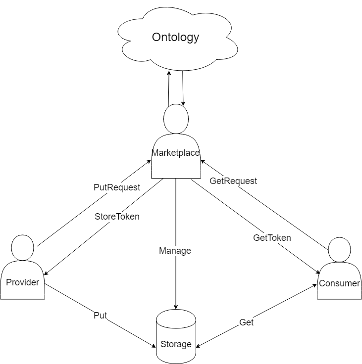

## 基于ONT ID的安全存储服务模型

在数据交易场景中，包括三个参与方：数据提供方，数据购买方，数据市场。
一笔完整的数据交易必然需要完成数据的交割，即提供方将数据加密后存储在数据市场的存储平台上，当数据交易成交后，购买方即可从该存储平台下载并解密。

下图描述了三个参与方在数据交割的逻辑顺序。

## 上传数据

提供方在数据交易成交后，将数据加密后存储在数据市场提供的存储平台上。在向存储平台上传数据之
前，首先需要向数据市场提交一个“存入请求”，该请求应当包括如下信息：
- 数据哈希值
- 数据文件大小
- 提供方的ONT ID
- 临时随机数（可选）
- 提供方的签名

数据市场验证该请求，包括文件大小是否超出最大允许范围、请求签名值是否合法等等。验证通过之后，数据市场应当返回一个“存入token”，该token的详细设计需遵循特定存储平台的要求。

### 数据加密流程
数据的加密使用如下的算法，简单来说，分为三个步骤：
1. 访问Ontology区块链，获取购买方的公钥；
2. 随机采样256比特数据，作为AES256加密密钥；
3. 将AES256加密密钥用公钥加密算法进行加密，数据使用AES256算法GCM模式进行加密。

## 下载数据
购买方完成资金交割之后，即具备权限来下载数据。从存储平台下载数据之前，需先向数据市场服务器提交一个“读取请求”，该请求应当包含如下信息：
- 数据文件的哈希值
- 数据文件大小
- 购买方的ONT ID
- 临时随机数（可选）
- 提供方的签名

数据市场服务器验证该请求，包括数据文件是否存在、签名是否合法、购买方是否具备读取权限等等。验证通过之后，数据市场应当返回一个“读取token”，该token的详细设计需遵循底层存储平台的要求。

### 数据解密流程
数据的解密按如下两个步骤进行：
1. 用私钥解密出AES对称密钥；
2. 用AES对称密钥，以AES256算法GCM模式解密数据。